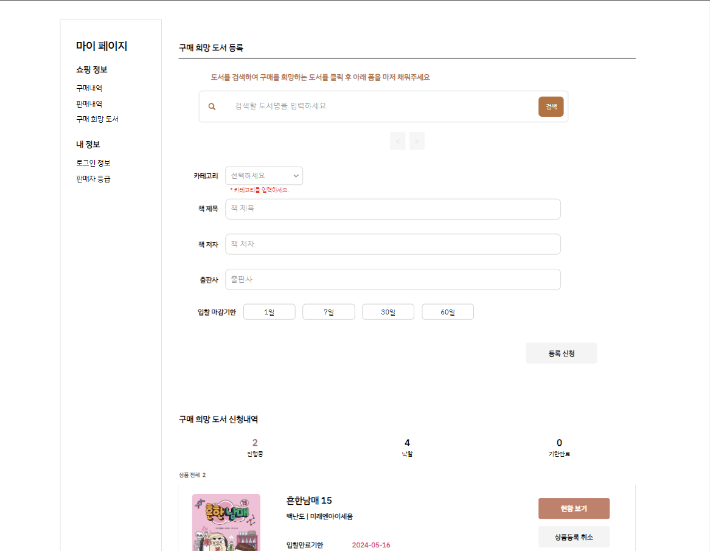
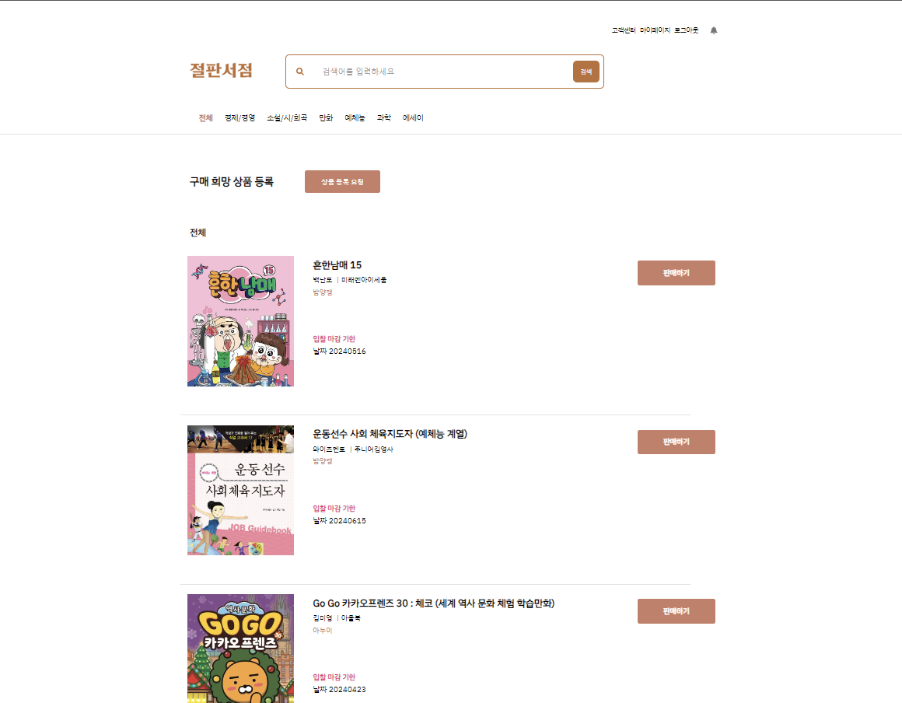
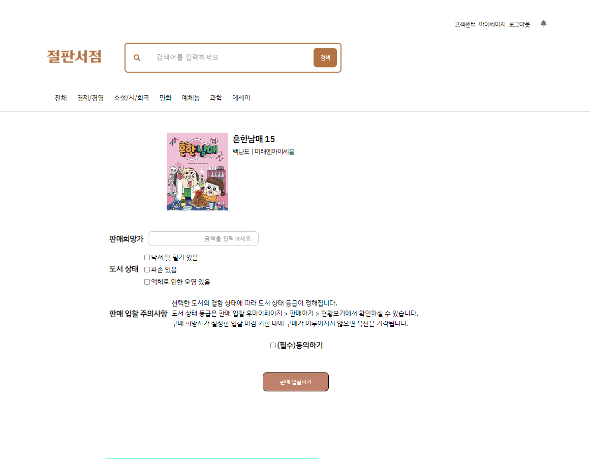
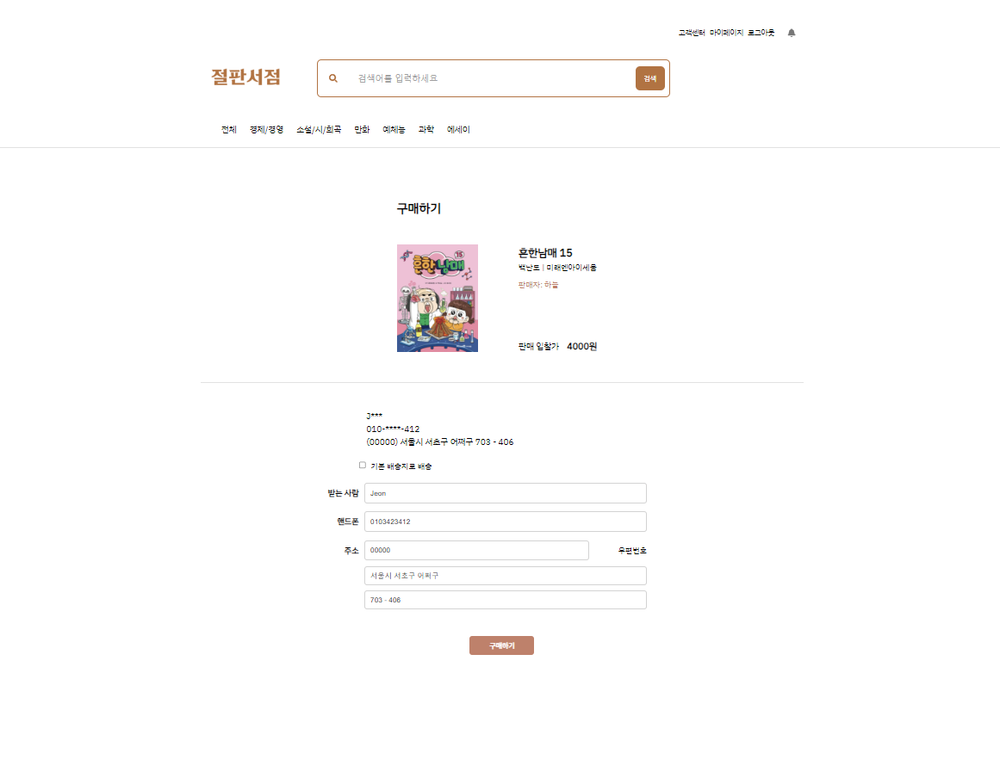
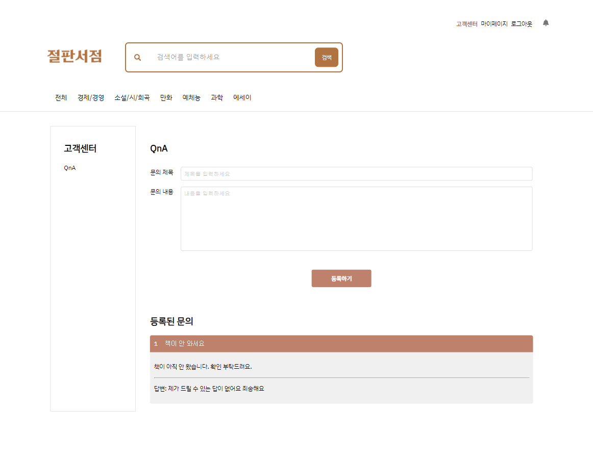
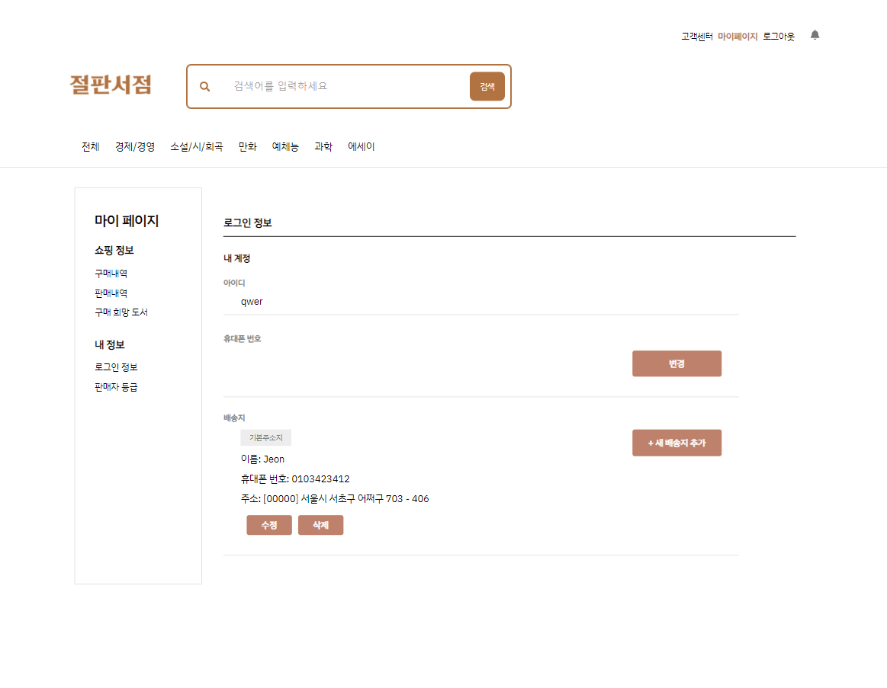
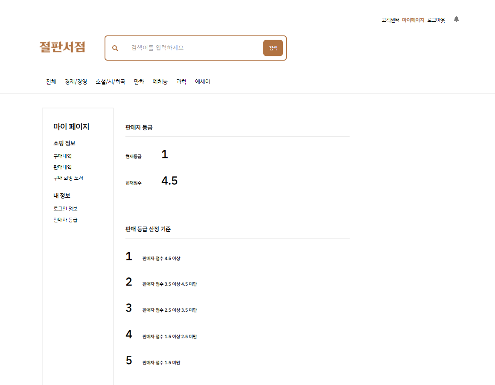

# 절판서점
> 수요자 : 공급자 = n : 1 경매 방식과 달리, 수요자 : 공급자 = 1: n 형태로 공급자들 간의 가격 경쟁을 유도하여 
역경매를 통해 가장 좋은 조건을 제시한 판매자를 구매자가 선택하여 거래할 수 있는 구매자 중심 웹 서비스
<br><br>구매자: "이 상품 판매 해줘" -> 판매자: "이 조건으로 판매할게"


## 프로젝트 정보

> 멀티캠퍼스 프론트엔드 개발자 과정 6기 Final Project <br>
> 개발 기간 `2024.03.14 ~ 2024.04.16`

## 팀 소개

### *Team Cocomoo*
> '코코무'는 코딩에 코딩을 무는 사람들의 줄인말로, 코딩이라는 활동을 계속해서 탐구하고 발전시키면서 좋은 영향력이 순환하는 것을 의미합니다.

|||||||
|:-:|:-:|:-:|:-:|:-:|:-:|
|**이총명**<br/>[@loi57111](https://github.com/loi57111)<br>SNS 연동 로그인<br>ERD 설계<br>RESTful API 작성|**서현우**<br/>[@Hyunwoo-Seo](https://github.com/Hyunwoo-Seo)<br>구매후기P 구현<br>도서리스트P 구현<br>로그인P 구현|**손보경**<br>[@sonlucy](https://github.com/sonlucy)<br>마이페이지 구현<br>메인페이지 구현<br>판매자정보P 구현|**유혜원**<br/>[@h1yoo](https://github.com/h1yoo)<br>구매하기P 구현<br>도서상세P 구현<br>회원가입P 구현<br>|**전윤하**<br/>[@YoonhaJ](https://github.com/YoonhaJ)<br>UI/UX 설계<br>도서검색 API<br>관리자P 구현<br>|**차유진**[@jinyucha](https://github.com/jinyucha)<br>고객센터P 구현<br>내정보P 구현<br>마이페이지 구현|


## 주요 화면 구성

|메인 페이지|구매희망도서 등록|
|:-:|:-:|
|||
|**도서 카테고리**|**판매입찰 하기**|
|||
|**구매하기**|**문의하기**|
|||
|**내정보 수정**|**판매 등급**|
|||

## 기술 스택
**Environment**

<br><br>

**Config**

<br><br>

**Development**

*front-end* <br>


*back-end*<br>


*Design*<br>


*Cooperation*<br>


## 개발 환경 설치/실행 방법

### backend
#### 데이터베이스 생성: table.sql

```sh
npm i
npm run dev
```

### frontend

```sh
npm i
npm start
```

